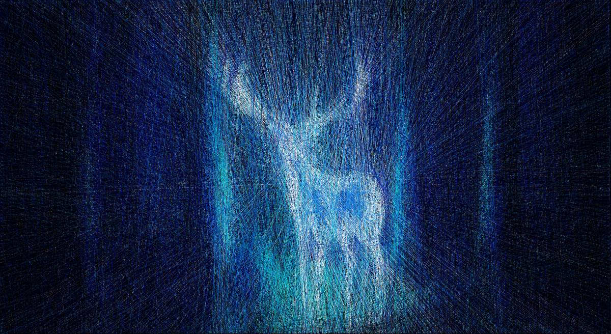

# Computational Thread Art

For more information, see the associated [blog post](https://www.perfectlynormal.co.uk/).

The Colab to make your own can be found [here](https://colab.research.google.com/drive/1mSFDFOOhXb46qJcAQ5cLQIzqG-HxsCMp). The Colab contains the code which generated this image, as well as the instructions to make it physically:

